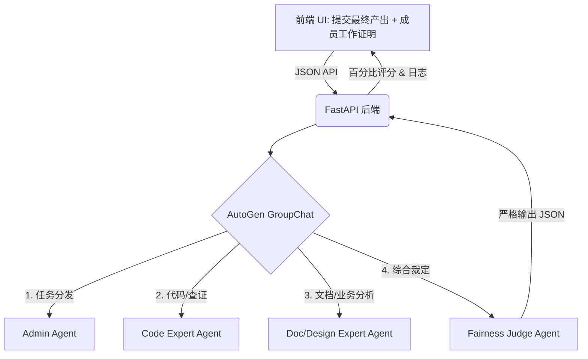

<div align="center">

# ⚖️ TrueMerit MAS

**基于多智能体与最终产物比对的端到端“零和”贡献度评估引擎**

[](https://www.python.org/)
[](https://fastapi.tiangolo.com/)
[](https://reactjs.org/)
[](https://microsoft.github.io/autogen/)
[](https://www.deepseek.com/)
[](https://opensource.org/licenses/MIT)

</div>

---

## 📖 项目简介 (Introduction)

在传统的团队协作和 DAO 组织中，“苦劳”往往容易被混淆为“功劳”。团队成员可能提交了大量的代码或文档，但最终真正被项目采纳的核心产出却很少。

**TrueMerit MAS (Multi-Agent System)** 旨在解决这一痛点。它引入了一个由 **DeepSeek** 驱动的虚拟专家评审团，通过**强制比对“最终项目产物” (Single Source of Truth)**，无情剥离无效工作量，并通过**零和博弈 (Zero-Sum Game)** 的方式，为团队计算出总和严格等于 100% 的真实贡献度。

### ✨ 核心亮点

* 🕵️ **基于最终产物的真实查证**：拒绝“PPT式邀功”。智能体（如 `Code_Expert`）会直接去最终合并的代码/文档中进行字符串级与逻辑级的查证。

* ⚖️ **100% 零和博弈仲裁**：由最高法官智能体 `Fairness_Judge` 进行最终裁决，确保全组评分相加绝对等于 100%，找出真正的 MVP。

* 🤖 **AutoGen 多智能体协作**：内置 Admin、代码专家、产品/设计专家、仲裁法官四个独立角色的 Agent，模拟真实企业级 Code Review 与绩效评审会议。

* 📦 **现代化的全栈交互**：基于 React + TailwindCSS 的前端，支持多成员配置、多文件拖拽上传，并实时可视化呈现智能体内部的思考/争论日志。

---

## 🏗️ 系统架构 (Architecture)



---

## 🚀 快速开始 (Quick Start)

### 1. 环境准备 (Prerequisites)

* Python 3.9+
* Node.js 18+ & npm
* 一个有效的 DeepSeek API Key (或任何兼容 OpenAI 格式的大模型 Key)

### 2. 获取代码

```bash
git clone [https://github.com/your-username/TrueMerit-MAS.git](https://github.com/your-username/TrueMerit-MAS.git)
cd TrueMerit-MAS

```

### 3. 后端部署 (Backend Setup)

后端基于 FastAPI 和 AutoGen 构建。

```bash
# 1. 进入后端目录
cd backend

# 2. 创建并激活虚拟环境 (推荐)
python -m venv venv
source venv/bin/activate  # Windows: .\venv\Scripts\activate

# 3. 安装依赖
pip install -r requirements.txt
# (如果没有 requirements.txt，可手动执行：pip install fastapi uvicorn pyautogen pydantic openai)

# 4. 配置 API Key
# 在 backend/config.py 中配置你的 DEEPSEEK_API_KEY，或通过环境变量导出：
export DEEPSEEK_API_KEY="sk-your-deepseek-api-key"

# 5. 启动服务
python backend_server.py
# 服务将运行在 [http://0.0.0.0:8000](http://0.0.0.0:8000)

```

### 4. 前端部署 (Frontend Setup)

前端基于 React + Vite + Tailwind CSS 构建。

```bash
# 1. 打开一个新的终端窗口，进入前端目录
cd frontend

# 2. 安装依赖
npm install

# 3. 启动开发服务器
npm run dev
# 浏览器将自动或手动打开 http://localhost:5173

```

---

## ⚙️ 配置文件说明 (Configuration)

### 后端配置 (`backend/config.py`)

在此文件中，你可以深度定制大模型的表现：

```python
LLM_CONFIG = {
    "config_list": [{
        "model": "deepseek-chat",
        "api_key": DEEPSEEK_API_KEY,
        "base_url": "[https://api.deepseek.com](https://api.deepseek.com)"
    }],
    "temperature": 0.1,  # 建议保持在 0.1-0.3，确保评分的确定性和严谨性
    "timeout": 600,      # 多文件阅读耗时较长，请保持高超时设定
}

```

### 前端配置 (`frontend/src/config.ts`)

如果要将项目部署到线上，请修改此文件中的接口地址：

```typescript
export const API_CONFIG = {
  BASE_URL: "http://localhost:8000", // 生产环境替换为你的真实域名
  EVALUATE_GROUP: "/api/evaluate_group",
};

```

---

## 🎯 使用指南 (Usage)

1. **确立基准 (Step 1)**：在前端界面的 Step 1 中，上传项目的“最终产物”文件（支持多选，如合并后的 `main.py`，或产品文档 `README.md`）。这是裁判组评判的唯一标准。
2. **填写成员贡献 (Step 2)**：点击“新增成员”，为每个团队成员填写职责。**强烈建议**使用“追加导入文件”功能，将个人的本地代码/文档传上来。
3. **启动评估 (Step 3)**：点击底部大按钮。此时不要关闭页面，系统可能需要 15~40 秒的时间让四个 Agent 互相交流、比对源码并进行激烈讨论。
4. **查看结果**：在右侧面板查看最终的环形进度条（总计 100%），并可以向下滚动阅读 `System Trace` 终端，观察法官和专家是如何戳穿“假贡献”的！

---

## 🛠️ 技术栈 (Tech Stack)

* **Backend**: Python, FastAPI, AutoGen, Pydantic, Uvicorn
* **Frontend**: React (TypeScript), Vite, Tailwind CSS, Lucide React (Icons)
* **AI Model**: DeepSeek V3 (可无缝切换至 GPT-4, Claude 等)

---

<div align="center">
<i>If you find this project useful, please consider giving it a ⭐️!</i>
</div>


